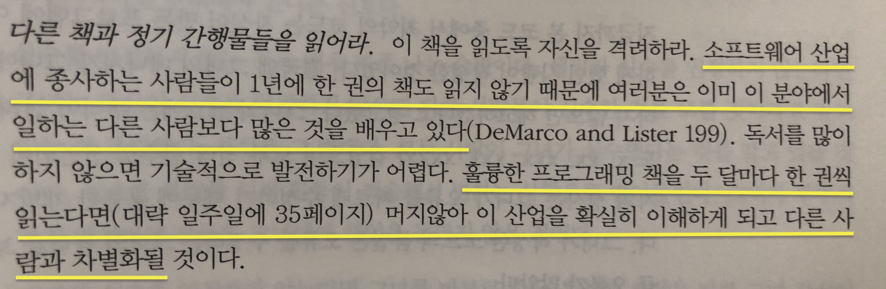

# 📖 TIR
Today I Read Challenge
하루에 읽을거리를 하나씩 읽고 자신의 생각(후기)을 공유한다.   

## 👩‍⚖️ 규칙  

1. 글의 종류는 잘 정리된 기사나 블로그 글, 책도 가능하며 너무 읽기가 싫다면 챌린지를 위해서 유튜브 영상이라도 시청하고 후기를 남긴다. 
2. 하루에 하나의 글이 원칙이지만 그 이상도 원하면 얼마든지 올린다. 
3. 문서 생성은 [markdown](https://gist.github.com/ihoneymon/652be052a0727ad59601)을 사용한다.   
    - 후기의 길이는 전혀 상관없으며 양식은 자유다.  
    - **❗단, 읽은 글의 링크는 꼭 남긴다. (링크가 없는 책의 경우 제외)** 
4. 카테고리로 폴더를 만든다. `.md`파일을 해당되는 카테고리 폴더에 넣는다.   
    - 카테고리는 개발 분야 외의 흥미가 가지는 것은 무엇이든지 가능하다.   
    
## 💬 기타  
1. 더 잘 활용할 수 있는 의견이 있다면 제시한다.  
2. 블로그의 글은 삭제될 수 있으니 두고두고 읽고 싶다면 스크랩 앱 등을 사용하는 것이 좋다.  
    - ex) [Notion](https://www.notion.so/), [Bear](https://bear.app/), [OneNote](https://www.onenote.com/), ⌨️직접 타이핑하기 등...
3. [Feedly](https://feedly.com/)를 사용해 해당 사이트를 등록하면 그 사이트에 올라오는 글은 바로바로 확인해 읽을 수 있다.   

## 😴 마음이 해이해질 때 

