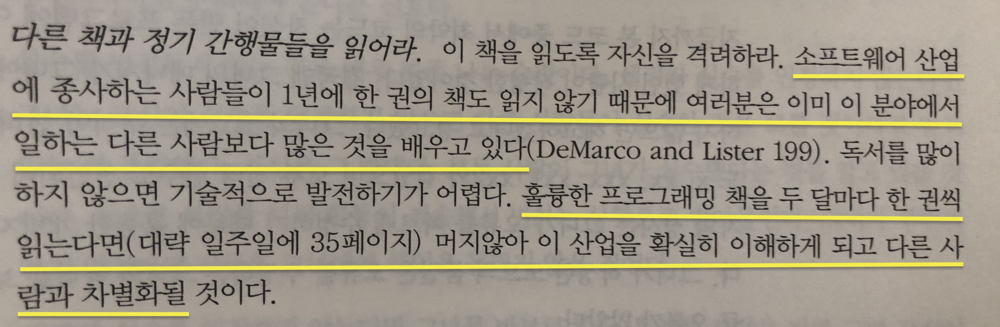

<h1 align="center">
  <br/>
  Today I Read
</h1>
<p align="center">하루에 <b>읽을거리</b>를 하나씩 읽고 <b>자신의 생각(후기)을 공유</b>한다. 


[https://tir.netlify.app](https://tir.netlify.app)

## 규칙 👩‍⚖️  

1. 글의 종류는 잘 정리된 기사나 블로그 글, 책도 가능하며 너무 읽기가 싫다면 유튜브 영상이라도 시청하고 후기를 남긴다. 
2. 하루에 하나의 글이 원칙이지만 그 이상도 원하면 얼마든지 올린다. 
3. 문서 생성은 [markdown](https://gist.github.com/ihoneymon/652be052a0727ad59601)을 사용한다.   
    - 후기의 길이는 전혀 상관없으며 양식은 자유다. 
4. 카테고리로 폴더를 만든다. `.md`파일을 해당되는 카테고리 폴더에 넣는다.   
    - 카테고리는 개발 분야 외의 흥미가 가지는 것은 무엇이든지 가능하다.   
    - **✅ `.md`파일에 다음과 같은 YAML Front matter 가 상단에 추가되어야 한다. title, publishDate는 필수항목이다.** 
        ```markdown
        ---
        title: 제목 
        link: 해당 글의 링크 
        publishDate: 2021-08-14
        tags:
          - tag1
          - tag2
        ---
        ```  
    - 파일 생성 후, `commit`, `push`를 하면 netlify에 배포된다.  
    - 로컬에서 작업
       ```
       # project setup 
       npm install
       npm run dev
       ```

## 기타 💬 
1. 더 잘 활용할 수 있는 의견이 있다면 제시한다.  
2. 블로그의 글은 삭제될 수 있으니 두고두고 읽고 싶다면 스크랩 앱 등을 사용하는 것이 좋다.  
    - ex) [Notion](https://www.notion.so/), [Bear](https://bear.app/), [OneNote](https://www.onenote.com/), ⌨️직접 타이핑하기 등...
3. [Feedly](https://feedly.com/)를 사용해 해당 사이트를 등록하면 그 사이트에 올라오는 글은 바로바로 확인해 읽을 수 있다.   

## 마음이 해이해질 때 😴 


[CODE COMPLETE 2 - Steve McConnell](http://www.kyobobook.co.kr/product/detailViewKor.laf?mallGb=KOR&ejkGb=KOR&barcode=9788956742564)


[[Interview] Women Leaders: South Korean Foreign Minister Kang Kyung-wha](https://youtu.be/5a8yiGfrI7s)

## Assets used from ⚡
- [Boxicons](https://boxicons.com/)
- [Google Fonts](https://fonts.google.com/)
- [Photopea](https://www.photopea.com/)


## Credits 💯
- [Responsive Website Restaurant](https://github.com/bedimcode/responsive-website-restaurant)
- [vue-markdown-blog](https://github.com/sunyuu/vue-markdown-blog)
- [https://www.sungikchoi.com/blog/gatsby-dark-mode/](https://www.sungikchoi.com/blog/gatsby-dark-mode/)
- [https://junilhwang.github.io/TIL/Vuepress/](https://junilhwang.github.io/TIL/Vuepress/)